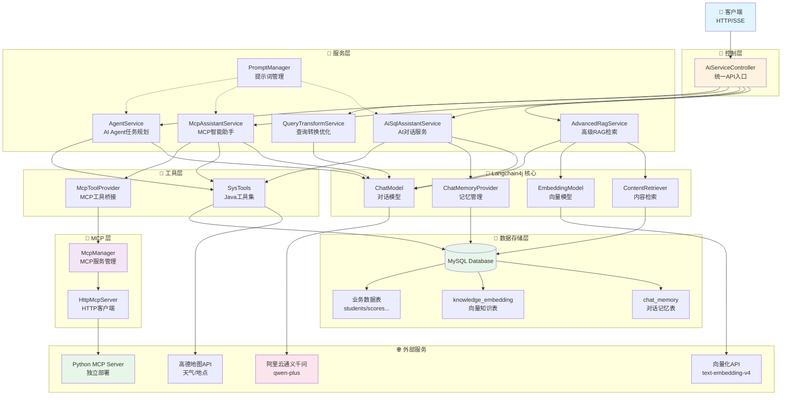

# 🤖 Robot - 智能对话机器人

<div align="center">

[](https://openjdk.java.net/)
[](https://spring.io/projects/spring-boot)
[](https://docs.langchain4j.dev/)
[](LICENSE)

**基于 Langchain4j 构建的企业级 AI 对话系统**

支持多轮对话 · RAG 检索 · 工具调用 · Text-to-SQL · MCP 协议 · 向量知识库

[快速开始](#-快速开始) · [功能特性](#-功能特性) · [API 文档](docs/API.md) · [系统架构](#-系统架构)

</div>

---

## 📖 项目简介

这是一个基于 **Langchain4j** 框架和 **阿里云通义千问** 大模型构建的智能对话机器人系统。项目展示了如何在 Spring Boot
应用中集成先进的 AI 能力，实现企业级的对话系统。

### ✨ 核心亮点

- 🧠 **智能对话记忆** - MySQL 持久化存储，支持多轮上下文对话
- 📚 **RAG 知识库** - 基于向量数据库的检索增强生成，提供专业领域问答
- 🔧 **工具调用能力** - AI 自主调用外部工具和 API，完成复杂任务
- 💬 **Text-to-SQL** - 自然语言转 SQL，无需编写代码即可查询数据库
- 🎯 **结构化输出** - 从非结构化文本中提取结构化数据
- 🔌 **MCP 协议支持** - 集成 Model Context Protocol，支持跨语言工具调用
- 📝 **Prompt 管理** - 集中式提示词管理，支持热更新和版本控制
- 🚀 **生产就绪** - 完整的错误处理、日志记录、性能优化

### 🎯 适用场景

- 🏢 企业智能客服系统
- 📊 BI 数据分析助手
- 💼 知识库问答系统
- 🔍 智能搜索引擎
- 🛠️ 开发者工具助手

---

## 🚀 功能特性

### 1️⃣ 多模式对话

| 模式         | 特性       | 场景     |
|------------|----------|--------|
| **基础对话**   | 无状态、快速响应 | 简单问答   |
| **流式对话**   | 实时输出、带记忆 | 长文本生成  |
| **RAG 对话** | 知识库增强    | 专业领域咨询 |

### 2️⃣ RAG 检索增强生成

```
用户提问 → 语义检索 → 知识注入 → AI 生成 → 专业回答
```

- ✅ 自动从知识库检索相关信息
- ✅ 支持大规模文档向量化
- ✅ 余弦相似度语义匹配
- ✅ 可配置的检索策略

### 3️⃣ Text-to-SQL 智能查询

自然语言直接转换为 SQL 语句，无需学习数据库语法：

```
输入: "查询上个月销售额超过10万的客户"
输出: SELECT customer_name, SUM(amount) 
      FROM orders 
      WHERE order_date >= DATE_SUB(NOW(), INTERVAL 1 MONTH)
      GROUP BY customer_id 
      HAVING SUM(amount) > 100000;
```

### 4️⃣ 工具调用 (Function Calling)

AI 可以自主判断并调用外部工具：

- 🌤️ 天气查询
- 📍 地址解析
- 🔍 地点搜索
- 🗄️ 数据库操作
- 🕐 时间计算
- 🧮 数学计算（Python MCP）
- 📁 文件操作（Python MCP）

### 5️⃣ 高级 RAG 技术

- 🔍 **查询改写** - 将简短查询扩展为详细描述，提升检索精度
- 🎯 **多查询检索** - 从多个角度理解问题，合并检索结果
- 📊 **Step-back 查询** - 先理解背景知识，再回答具体问题
- 🔄 **混合检索** - 结合语义和关键词，避免检索偏差

### 6️⃣ MCP (Model Context Protocol) 集成

支持通过 MCP 协议调用外部服务：

- 🔌 **跨语言工具集成** - Java 与 Python 工具无缝协作
- 🌐 **HTTP 独立部署** - Python MCP Server 独立运行，易于扩展
- 🤖 **AI 自动调度** - AI 自主判断调用 Java 工具或 MCP 工具
- 📦 **动态工具发现** - 自动注册和管理 MCP 服务

### 7️⃣ Prompt 管理系统

- 📝 **集中管理** - 所有提示词统一存储和维护
- 🔄 **热更新** - 无需重启应用即可修改 Prompt
- 📊 **版本控制** - 支持 Prompt 版本管理和历史记录
- 🎯 **多场景支持** - 预置多种场景模板（SQL 专家、旅行规划等）

---

## 🛠️ 技术栈

### 核心框架

- **Spring Boot 3.5.7** - 企业级应用框架
- **Langchain4j 1.0.1** - Java AI 开发框架
- **Java 21** - 最新 LTS 版本

### AI 能力

- **阿里云通义千问**
    - `qwen-plus` - 对话生成模型
    - `text-embedding-v4` - 向量化模型 (1536维)
    - `qwen-vl-plus` - 多模态视觉模型

### 数据存储

- **MySQL 8.0+** - 关系型数据库
- **MyBatis-Plus 3.5.7** - ORM 框架
- **自研向量存储** - 基于 MySQL 的向量检索

### 其他组件

- **Project Reactor** - 响应式编程（流式输出）
- **RestTemplate** - HTTP 客户端（外部 API 调用）
- **Apache Commons Math** - 数学计算（余弦相似度）
- **Flask** - Python MCP Server 框架

---

## 📊 系统架构



---

## 🚀 快速开始

### 🎨 前端管理界面（新增！）

本项目现已集成 **Vue 3 前端管理界面**，可视化测试所有功能！

**3 步启动**：

```bash
# 1. 构建前端
cd frontend && ./build.sh    # Mac/Linux
cd frontend && build.bat     # Windows

# 2. 启动后端
cd .. && mvn spring-boot:run

# 3. 访问界面
http://localhost:8080
```

详细说明：[前端快速启动指南](docs/QUICKSTART_FRONTEND.md)

---

### 方式一：Docker 一键部署

最快的启动方式，无需安装 Java、MySQL、Python 等依赖。

#### 前置要求

- Docker 20.10+
- Docker Compose 2.0+
- 通义千问 API Key

#### 启动步骤

```bash
# 1. 克隆项目
git clone git@github.com:zhulaoqi/robot.git
cd robot

# 2. 配置环境变量
cp docker/env.example docker/.env
vi docker/.env  # 填入你的 百炼平台和高德平台key

# 3. 一键启动（自动启动 MySQL + Java 服务 + Python MCP Server）
cd docker && ./start.sh

# 或者使用 docker-compose
cd docker && docker-compose up -d
```

服务启动后：

- Java 主服务：http://localhost:8080
- Python MCP Server：http://localhost:5001
- MySQL：localhost:3306

详细的 Docker 部署文档请参考：[docker/README.md](docker/README.md)

---

### 方式二：本地开发部署

#### 前置要求

- JDK 21+
- Maven 3.8+
- MySQL 8.0+
- Python 3.8+ (可选，用于 MCP Server)
- [通义千问 API Key](https://dashscope.aliyun.com/)

#### 1. 克隆项目

```bash
git clone git@github.com:zhulaoqi/robot.git
cd robot
```

#### 2. 配置数据库

```sql
CREATE DATABASE langchain_db CHARACTER SET utf8mb4 COLLATE utf8mb4_unicode_ci;
```

执行数据库初始化脚本（项目启动时会自动创建表）。

#### 3. 配置 API Key

修改 `src/main/resources/application.yaml`：

```yaml
langchain4j:
  open-ai:
    chat-model:
      api-key: sk-your-api-key-here  # 替换为你的 API Key
```

#### 4. 启动 Python MCP Server（可选）

如果需要使用 MCP 功能：

```bash
# 安装依赖
pip3 install flask

# 启动 MCP Server
python3 docs/mcp_server_http.py
```

MCP Server 将在 `http://localhost:5001` 启动。

#### 5. 启动 Java 应用

```bash
mvn spring-boot:run
```

应用启动后访问：`http://localhost:8080`

---

### 快速测试

```bash
# 测试基础对话
curl "http://localhost:8080/ai/chat/test"

# 添加知识到向量库
curl -X POST "http://localhost:8080/ai/chat/knowledge/add" \
  -H "Content-Type: text/plain;charset=UTF-8" \
  -d "Langchain4j 是一个用于构建 AI 应用的 Java 框架"

# 测试 MCP 工具调用（需要先启动 Python MCP Server）
curl -G "http://localhost:8080/ai/chat/mcp/chat" \
  --data-urlencode "message=帮我计算 sqrt(16) + pow(2, 3)"
```

---

## 💡 使用示例

### 示例 1: 多轮对话记忆

AI 会记住上下文，支持连续对话：

```
用户: 我叫张三，今年25岁
AI: 你好，张三！很高兴认识你。

用户: 我刚才说我叫什么？
AI: 你说你叫张三，今年25岁。
```

### 示例 2: Text-to-SQL

自然语言查询数据库：

```
用户: 查询所有在读学生的姓名和学号
AI: 
SELECT student_no, name 
FROM students 
WHERE status = '在读';

已为您查询到 120 名在读学生。
```

### 示例 3: 工具调用

AI 自动调用外部工具：

```
用户: 深圳今天天气怎么样？
AI: [调用天气API] 深圳今天晴天，温度25-32℃，空气质量良好。

用户: 帮我查一下附近的咖啡店
AI: [调用地点搜索API] 为您找到3家咖啡店：
    1. 星巴克（距离500米）
    2. Costa（距离800米）
    3. Luckin Coffee（距离1.2公里）
```

### 示例 4: MCP 跨语言工具调用

AI 自动选择合适的工具（Java 或 Python）：

```
用户: 帮我计算 sqrt(16) + pow(2, 3)，然后查询深圳天气
AI: 
[调用 Python MCP calculator] 计算结果：12.0
[调用 Java getWeather] 深圳今天晴天，温度25-32℃

计算结果是12.0，深圳今天天气晴朗，温度适宜。
```

### 示例 5: Prompt 热更新

无需重启即可优化 AI 行为：

```bash
# 查看当前 Prompt
curl "http://localhost:8080/ai/chat/prompts/sql_expert"

# 更新 Prompt（立即生效）
curl -X PUT "http://localhost:8080/ai/chat/prompts/sql_expert" \
  -d "content=你是SQL专家，对课程名使用模糊匹配&version=2.1"
```

---

## 📡 核心 API

### 对话接口

- `GET /ai/chat/test` - 测试接口
- `GET /ai/chat?memoryId={id}&userMessage={msg}` - 带记忆对话
- `GET /ai/chat/{id}/stream/memory?userMessage={msg}` - 流式对话

### MCP 功能

- `GET /ai/chat/mcp/chat?message={msg}` - MCP 智能助手（AI 自动调度工具）
- `GET /ai/chat/mcp/servers` - 列出所有 MCP 服务
- `GET /ai/chat/mcp/tools` - 列出所有可用工具
- `POST /ai/chat/mcp/execute` - 手动执行 MCP 工具

### 知识库管理

- `POST /ai/chat/knowledge/add` - 添加知识
- `GET /ai/chat/knowledge/search?query={q}` - 向量检索
- `DELETE /ai/chat/knowledge/clear` - 清空知识库
- `GET /ai/chat/knowledge/stats` - 统计信息

### RAG 功能

- `GET /ai/chat/{id}/sql/generate?userMessage={msg}` - SQL 生成
- `POST /ai/chat/knowledge/load-student-ddl` - 加载数据库结构

### 高级 RAG

- `GET /ai/chat/query/expand?query={q}` - 查询扩展
- `GET /ai/chat/rag/with-query-transform?query={q}` - 查询改写 RAG
- `GET /ai/chat/rag/compare-all?query={q}` - RAG 方法对比

### Prompt 管理

- `GET /ai/chat/prompts/list` - 列出所有 Prompt
- `GET /ai/chat/prompts/{key}` - 获取指定 Prompt
- `PUT /ai/chat/prompts/{key}` - 更新 Prompt（热更新）

### 工具调用

- `GET /ai/chat/agent/plan-trip?request={req}` - AI Agent 规划任务
- 更多 API 详见 [API 文档](docs/API.md)

---

## ⚙️ 配置说明

### 核心配置

```yaml
langchain4j:
  open-ai:
    chat-model:
      model-name: qwen-plus          # 对话模型
      temperature: 0.7               # 创造性（0-1）
      max-tokens: 2000               # 最大输出长度
    embedding-model:
      model-name: text-embedding-v4  # 向量模型

# MCP 配置
mcp:
  python:
    server:
      url: http://localhost:5000     # Python MCP Server 地址

# 外部 API 配置
external-api:
  amap:
    key: your-amap-api-key           # 高德地图 API Key
```

### RAG 参数调优

```java
ContentRetriever retriever = EmbeddingStoreContentRetriever.builder()
        .embeddingStore(embeddingStore)
        .embeddingModel(embeddingModel)
        .maxResults(10)      // 检索数量：5-20
        .minScore(0.3)       // 相似度阈值：0.3-0.7
        .build();
```

### 性能优化建议

| 场景          | 配置建议                              |
|-------------|-----------------------------------|
| 提高检索准确性     | `minScore: 0.3`, `maxResults: 15` |
| 降低 Token 消耗 | `maxMessages: 3`, `maxResults: 5` |
| 处理长文档       | `chunkSize: 1000`, `overlap: 150` |

---

## 📁 项目结构

```
robot/
├── src/main/java/com/mcp/robot/
│   ├── config/              # 配置类
│   │   ├── AiConfiguration.java
│   │   └── McpAutoConfiguration.java
│   ├── controller/          # REST 控制器
│   │   └── AiServiceController.java
│   ├── service/             # 业务服务
│   │   ├── AiSqlAssistantService.java
│   │   ├── McpAssistantService.java
│   │   ├── AdvancedRagService.java
│   │   ├── QueryTransformService.java
│   │   ├── AgentService.java
│   │   ├── VisionService.java
│   │   └── PromptManager.java
│   ├── mcp/                 # MCP 协议实现
│   │   ├── McpServer.java
│   │   ├── McpManager.java
│   │   └── HttpMcpServer.java
│   ├── tools/               # AI 工具类
│   │   ├── SysTools.java
│   │   └── McpToolProvider.java
│   ├── mapper/              # 数据访问层
│   │   ├── ChatMemoryMapper.java
│   │   └── KnowledgeEmbeddingMapper.java
│   └── model/               # 数据模型
│       ├── ChatMemoryEntity.java
│       ├── KnowledgeEmbeddingEntity.java
│       ├── McpToolRequest.java
│       └── Person.java
├── src/main/resources/
│   ├── application.yaml     # 配置文件
│   └── student_ddl.sql      # 示例数据库结构
├── docs/                    # 文档目录
│   ├── API.md               # API 文档
│   ├── README.md            # 详细文档
│   └── mcp_server_http.py   # Python MCP Server
└── pom.xml                  # Maven 配置
```

---

## 🔧 高级特性

### 1. MCP (Model Context Protocol)

支持跨语言工具调用：

**架构优势**：

- ✅ Java 主服务 + Python 工具服务独立部署
- ✅ HTTP 通信，易于横向扩展
- ✅ AI 自动判断调用哪个工具（Java 或 Python）
- ✅ 支持动态工具发现和注册

**可用工具**：

- `calculator` - 复杂数学计算（支持三角函数、开方等）
- `getPythonTime` - 格式化时间获取
- `readFile` / `writeFile` - 文件操作

### 2. Prompt 管理系统

集中管理所有 AI 提示词：

**核心功能**：

- 📝 统一存储：所有 Prompt 集中管理
- 🔄 热更新：无需重启即可修改
- 📊 版本控制：支持 Prompt 历史追踪
- 🎯 场景预置：SQL 专家、旅行规划、数据分析等

**使用场景**：

- A/B 测试不同 Prompt 效果
- 生产环境快速修复 AI 行为
- 多租户/多场景 Prompt 隔离

### 3. 查询转换（Query Transformation）

提升 RAG 检索精度：

- **查询扩展**: 将简短查询补充为详细描述
- **多视角查询**: 从不同角度理解问题
- **Step-back**: 先查背景知识，再查具体答案

### 4. AI Agent

多步骤任务规划和执行：

```
用户: 帮我规划一个三天的北京旅游行程
AI: 
  1. 查询北京天气 → 晴天
  2. 搜索热门景点 → 故宫、长城、颐和园
  3. 规划路线 → Day1: 故宫+天安门, Day2: 长城...
  4. 推荐美食 → 北京烤鸭、老北京炸酱面...
```

---

## ❓ 常见问题

<details>
<summary><strong>Q: 为什么用 MySQL 存储向量而不是专业向量数据库？</strong></summary>

**A**: 本项目是学习项目，MySQL 方案：

- ✅ 零额外部署成本
- ✅ 适合小规模数据（< 10000 条）
- ✅ 便于理解向量检索原理

生产环境推荐：PostgreSQL + pgvector 或 Milvus
</details>

<details>
<summary><strong>Q: 如何提高 Text-to-SQL 的准确性？</strong></summary>

**A**:

1. 添加课程名称映射知识（处理简称问题）
2. 使用 LIKE 模糊匹配代替精确匹配
3. 优化系统提示词，提供 SQL 示例
4. 降低检索阈值到 0.3，增加 maxResults 到 10

</details>

<details>
<summary><strong>Q: MCP Server 启动失败怎么办？</strong></summary>

**A**:

1. 确认 Python 3.8+ 已安装
2. 安装 Flask: `pip3 install flask`
3. 检查端口 5000 是否被占用: `lsof -i :5000`
4. 查看 MCP Server 日志排查错误
5. 不使用 MCP 功能也不影响主服务运行

</details>

<details>
<summary><strong>Q: 如何添加自定义 MCP 工具？</strong></summary>

**A**:

1. 在 `docs/mcp_server_http.py` 中添加新工具函数
2. 在 `McpToolProvider.java` 中添加对应的 `@Tool` 方法
3. 重启 MCP Server 和 Java 应用
4. AI 即可自动调用新工具

</details>

---

## 📚 学习资源

- 📖 [Langchain4j 官方文档](https://docs.langchain4j.dev/)
- 🌐 [通义千问 API 文档](https://bailian.console.aliyun.com/)
- 🎓 [RAG 技术详解](https://www.pinecone.io/learn/retrieval-augmented-generation/)
- 🔌 [Model Context Protocol](https://modelcontextprotocol.io/)
- 📝 [项目详细文档](docs/)

---

## 🎓 AI 应用开发最佳实践

本项目是一个完整的 AI 应用学习案例，涵盖了从基础对话到复杂任务编排的全流程。以下是在开发过程中总结的核心经验和技巧。

### 1️⃣ Prompt 工程技巧

#### 🎯 核心原则

- **明确角色定位**: 在 `@SystemMessage` 中清晰定义 AI 的角色和能力边界
- **提供上下文**: 使用 RAG 注入相关知识（如数据库 DDL），让 AI 基于事实回答
- **结构化输出**: 使用 `@UserMessage` + 模板变量控制输出格式
- **Few-shot 示例**: 在 Prompt 中提供 2-3 个示例，显著提升准确性

#### 💡 实战技巧

```java
// ✅ 好的 Prompt 设计
@SystemMessage("""
    你是一个专业的 SQL 助手，专注于学生管理系统。
    
    核心能力：
    - 将自然语言转换为标准 SQL
    - 对课程名使用 LIKE 模糊匹配
    - 优先使用索引字段提升性能
    
    示例：
    输入："查询计算机学院的学生"
    输出：SELECT * FROM students WHERE department_id = 
          (SELECT id FROM departments WHERE name LIKE '%计算机%')
    
    注意事项：
    - 必须返回可执行的 SQL 语句
    - 避免使用 SELECT *，明确列名
    - 添加必要的 WHERE 条件防止全表扫描
    """)
```

#### 🔥 热更新 Prompt

使用 `PromptManager` + `@V` 注解实现运行时 Prompt 修改：

```java
// 定义动态 Prompt 接口
@AiService
public interface DynamicSqlAssistantService {
    @SystemMessage("{{systemPrompt}}")  // 使用模板变量
    String chatWithSql(
        @MemoryId String memoryId,
        @V("systemPrompt") String systemPrompt,  // 运行时注入
        @UserMessage String userMessage
    );
}

// 使用时从 PromptManager 获取最新 Prompt
String prompt = promptManager.getPrompt("sql_expert");
String result = service.chatWithSql(memoryId, prompt, userMessage);
```

**优势**：
- ✅ 无需重启应用即可优化 AI 行为
- ✅ 支持 A/B 测试不同 Prompt 版本
- ✅ 生产环境快速修复 AI 错误

---

### 2️⃣ RAG 检索优化技巧

#### 🔍 参数调优

```java
ContentRetriever retriever = EmbeddingStoreContentRetriever.builder()
    .embeddingStore(embeddingStore)
    .embeddingModel(embeddingModel)
    .maxResults(10)      // 检索数量：5-20（越多越准确但 Token 消耗越大)
    .minScore(0.3)       // 相似度阈值：0.3-0.7（越低召回越多）
    .build();
```

| 场景         | maxResults | minScore | 说明                |
|------------|------------|----------|-------------------|
| 精确匹配       | 5          | 0.6      | 只返回高度相关的结果        |
| 广泛召回       | 15         | 0.3      | 宁可错检不可漏检          |
| 平衡方案（推荐）   | 10         | 0.4      | 准确性和召回率的平衡        |
| 长文档问答      | 20         | 0.35     | 需要更多上下文信息         |

#### 🎯 高级 RAG 技术

**1. 查询改写（Query Rewriting）**

将用户的简短查询扩展为详细描述，提升检索精度：

```java
// 原始查询: "学生成绩"
// 扩展后: "查询学生的考试成绩，包括学号、姓名、课程名称、分数等信息"
String expandedQuery = queryTransformService.expandQuery(originalQuery);
```

**2. 多查询检索（Multi-Query）**

从多个角度理解问题，合并检索结果：

```java
// 原始问题: "如何提高成绩？"
// 生成多个查询:
// - "学生成绩提升方法"
// - "学习效率优化技巧"
// - "考试成绩影响因素"
List<String> queries = queryTransformService.generateMultipleQueries(question);
```

**3. Step-back 查询**

先检索背景知识，再回答具体问题：

```java
// 具体问题: "张三的数学成绩是多少？"
// Step-back: "学生成绩查询的数据表结构是什么？"
String backgroundQuery = queryTransformService.generateStepBackQuery(question);
```

#### ⚠️ 常见陷阱

- **❌ 全局 RAG**: 不要对所有接口都启用 `contentRetriever`，会导致无关知识注入
- **✅ 按需 RAG**: 为不同场景创建独立的 `@AiService` 接口

```java
// ❌ 错误：全局启用 RAG
@AiService(contentRetriever = "contentRetriever")  // 所有方法都会检索
public interface AiService {
    String generateSQL(String query);      // 需要 RAG ✅
    String mockUsernames(int count);       // 不需要 RAG ❌
}

// ✅ 正确：按场景拆分
@AiService(contentRetriever = "contentRetriever")
public interface SqlAssistantService {
    String generateSQL(String query);  // 只有 SQL 生成需要 RAG
}

@AiService  // 不启用 RAG
public interface DataGeneratorService {
    String mockUsernames(int count);  // 纯文本生成
}
```

---

### 3️⃣ AI Agent 任务编排

#### 🤖 多种 Agent 模式

本项目实现了 4 种主流 Agent 模式：

| 模式                         | 特点            | 适用场景          |
|----------------------------|---------------|---------------|
| **ReAct**                  | AI 自主决策工具调用  | 通用任务（默认）      |
| **Plan-and-Execute**       | 先规划再执行        | 复杂多步骤任务       |
| **Reflexion**              | 执行 → 反思 → 改进 | 代码生成、需要自我检查的任务 |
| **Chain of Thought (CoT)** | 显示推理过程        | 数学题、逻辑推理      |

#### 🧭 智能路由机制

使用 `AgentRouterService` 自动选择合适的 Agent 模式：

```java
// 规则路由 + AI 路由混合
Map<String, Object> result = agentRouterService.route(userInput);

// 路由逻辑：
// - "帮我规划..." → Plan-and-Execute
// - "写一个函数..." → Reflexion
// - "计算..." → Chain of Thought
// - 其他 → ReAct
```

#### 📋 任务编排流程

完整的任务编排包含 4 个阶段：

```
1️⃣ 意图理解 → 2️⃣ 任务规划 → 3️⃣ 逐步执行 → 4️⃣ 结果汇总
```

**关键设计**：

```java
// 使用执行器工厂模式，自动路由到正确的执行器
Map<String, Object> result = orchestrationService.orchestrate(userRequest);

// 任务类型自动识别：
// - SQL_QUERY: 查询数据库（自动检索 DDL + 生成 SQL）
// - DATA_ANALYSIS: 数据分析（先查询再分析）
// - TOOL_CALL: 调用工具（天气、地点等）
// - CALCULATION: 数学计算
// - MCP_TOOL: Python 工具调用
// - TEXT_GENERATION: 文本生成
```

#### 🏭 执行器工厂模式

**核心优势**：
- ✅ 自动注册：Spring 自动扫描所有 `TaskExecutor` 实现类
- ✅ 动态路由：根据任务类型自动选择执行器
- ✅ 易于扩展：新增执行器只需实现 `TaskExecutor` 接口

```java
// 1. 定义执行器接口
public interface TaskExecutor {
    String execute(String taskDescription, Map<String, Object> context);
    TaskType supportedType();
}

// 2. 实现具体执行器
@Component
public class SqlQueryExecutor implements TaskExecutor {
    public String execute(String task, Map<String, Object> context) {
        // 执行 SQL 查询逻辑
    }
    public TaskType supportedType() {
        return TaskType.SQL_QUERY;
    }
}

// 3. 工厂自动注册
@Component
public class TaskExecutorFactory {
    public TaskExecutorFactory(List<TaskExecutor> executorList) {
        // Spring 自动注入所有执行器
        for (TaskExecutor executor : executorList) {
            executors.put(executor.supportedType(), executor);
        }
    }
}

// 4. 使用工厂执行任务
String result = executorFactory.executeTask(TaskType.SQL_QUERY, "查询学生", context);
```

---

### 4️⃣ 交互式 AI 体验

#### 🎬 流式输出（SSE）

使用 Server-Sent Events 实现类似 ChatGPT 的打字机效果：

```java
@GetMapping(value = "/stream", produces = "text/event-stream")
public Flux<String> streamChat(@RequestParam String message) {
    return Flux.create(sink -> {
        streamingChatModel.generate(message, new StreamingResponseHandler<>() {
            public void onNext(String token) {
                sink.next("data: " + token + "\n\n");
            }
            public void onComplete(Response<AiMessage> response) {
                sink.complete();
            }
        });
    });
}
```

#### 🛑 任务控制（Stop-and-Go）

实现任务的暂停、恢复、停止：

```java
// 启动任务
String taskId = interactiveTaskService.startTask(userRequest);

// 暂停任务
interactiveTaskService.pauseTask(taskId);

// 恢复任务
interactiveTaskService.resumeTask(taskId);

// 停止任务
interactiveTaskService.stopTask(taskId);

// 查询状态
Map<String, Object> status = interactiveTaskService.getTaskStatus(taskId);
```

#### 📡 实时进度推送

使用 SSE 推送任务执行的每个阶段：

```java
@GetMapping(value = "/orchestration/streaming", produces = "text/event-stream")
public Flux<String> orchestrateStreaming(@RequestParam String request) {
    return streamingOrchestration.orchestrateWithStreaming(request);
}

// 前端接收事件：
// event: intent_analysis → 意图理解完成
// event: task_planning → 任务规划完成
// event: task_start → 开始执行任务 1
// event: task_complete → 任务 1 完成
// event: summary → 最终结果汇总
```

**用户体验**：
- ✅ 实时可见：用户能看到 AI 的思考过程
- ✅ 可控性强：可以随时暂停或停止任务
- ✅ 类似 Cursor：与 Cursor AI 的交互体验一致

---

### 5️⃣ 性能优化技巧

#### 💾 对话记忆缓存

避免每次都查询数据库：

```java
@Cacheable(value = "chatMemory", key = "#memoryId.toString()")
public List<ChatMessage> getMessages(Object memoryId) {
    // 首次查询数据库，后续从缓存读取
}

@CacheEvict(value = "chatMemory", key = "#memoryId.toString()")
public void updateMessages(Object memoryId, List<ChatMessage> messages) {
    // 更新时清除缓存
}
```

#### 🔍 向量检索优化

- **批量插入**: 使用 `addAll()` 代替逐条 `add()`
- **索引优化**: 在 `embedding_id` 和 `created_time` 上建立索引
- **分页查询**: 大规模检索时使用 `LIMIT` 分页

#### 📊 日志调试

开启详细日志查看 AI 交互细节：

```yaml
logging:
  level:
    dev.langchain4j: DEBUG           # Langchain4j 框架日志
    com.mcp.robot: DEBUG             # 应用日志
    com.mcp.robot.mapper: DEBUG      # MyBatis SQL 日志

langchain4j:
  open-ai:
    chat-model:
      log-requests: true             # 记录请求内容
      log-responses: true            # 记录响应内容
```

---

### 6️⃣ 常见问题解决

#### ❓ Prompt 不生效？

**原因**: `@SystemMessage` 是编译时固定的，无法热更新。

**解决**: 使用 `@SystemMessage("{{systemPrompt}}")` + `@V("systemPrompt")` 动态注入。

#### ❓ RAG 检索不到内容？

**排查步骤**:
1. 检查 `minScore` 是否过高（建议 0.3-0.4）
2. 检查向量是否正确存储（`SELECT COUNT(*) FROM knowledge_embedding`）
3. 检查查询是否与知识库内容相关
4. 开启 DEBUG 日志查看检索过程

#### ❓ 工具调用失败？

**排查步骤**:
1. 检查 `@Tool` 方法签名是否正确
2. 检查 `description` 是否清晰描述了工具用途
3. 检查外部 API Key 是否配置
4. 查看日志中的工具调用记录

#### ❓ MCP 工具不可用？

**排查步骤**:
1. 确认 Python MCP Server 已启动（`http://localhost:5001/tools`）
2. 检查 `mcp.python.server.url` 配置
3. 测试 MCP Server 是否可访问（`curl http://localhost:5001/tools`）
4. 查看 MCP Server 日志

---

### 7️⃣ 最佳实践总结

#### ✅ DO - 推荐做法

- ✅ 为不同场景创建独立的 `@AiService` 接口
- ✅ 使用 `PromptManager` 管理所有 Prompt
- ✅ 在 Prompt 中提供 2-3 个示例（Few-shot）
- ✅ 使用 `@V` 注解实现动态 Prompt
- ✅ 对高频查询启用缓存（`@Cacheable`）
- ✅ 使用执行器工厂模式管理多种任务类型
- ✅ 开启 DEBUG 日志调试 AI 交互
- ✅ 使用 SSE 实现流式输出和进度推送

#### ❌ DON'T - 避免做法

- ❌ 不要全局启用 `contentRetriever`（按需启用）
- ❌ 不要在 `@SystemMessage` 中硬编码业务逻辑
- ❌ 不要忽略 `minScore` 参数（会影响检索准确性）
- ❌ 不要在生产环境使用 `temperature=1.0`（太随机）
- ❌ 不要忘记清理测试数据（避免影响 RAG 检索）
- ❌ 不要在 Prompt 中使用模糊的描述（要具体明确）

---

### 8️⃣ 学习路径建议

**初学者**（0-1 周）:
1. 跑通基础对话接口
2. 理解 `@AiService` 和 `@Tool` 的工作原理
3. 学习 Prompt 工程基础

**进阶**（1-2 周）:
1. 实现 RAG 知识库检索
2. 学习 Text-to-SQL 实现
3. 掌握 Prompt 热更新机制

**高级**（2-4 周）:
1. 实现多种 Agent 模式
2. 构建任务编排系统
3. 优化 RAG 检索策略
4. 实现交互式 AI 体验（SSE + 任务控制）

---

### 9️⃣ 参考资料

- 📖 [Langchain4j 官方文档](https://docs.langchain4j.dev/)
- 🎓 [Prompt Engineering Guide](https://www.promptingguide.ai/)
- 🔍 [RAG 技术详解](https://www.pinecone.io/learn/retrieval-augmented-generation/)
- 🤖 [AI Agent 设计模式](https://www.deeplearning.ai/the-batch/)
- 📝 [本项目 API 文档](docs/API.md)
- 🚀 [Agent Demo 文档](docs/AGENT_DEMO.md)

---

## 🤝 贡献指南

我们欢迎所有形式的贡献！

### 如何贡献

1. Fork 本仓库
2. 创建特性分支 (`git checkout -b feature/AmazingFeature`)
3. 提交改动 (`git commit -m 'Add some AmazingFeature'`)
4. 推送到分支 (`git push origin feature/AmazingFeature`)
5. 提交 Pull Request

### 代码规范

- 遵循 Java 命名规范
- 添加必要的注释
- 提供单元测试
- 更新相关文档

---

## 📄 许可证

本项目采用 [MIT License](LICENSE) 许可证。

---

## 🌟 Star History

如果这个项目对你有帮助，欢迎 Star ⭐ 支持！

[](https://star-history.com/#zhulaoqi/robot&Date)

---

## 📧 联系方式

- 📮 提交问题: [GitHub Issues](https://github.com/zhulaoqi/robot/issues)
- 📧 邮箱联系: 1647110340@qq.com
- ⭐ 欢迎 Star 和 Fork

---

<div align="center">

**如果觉得项目不错，请点个 ⭐ Star 支持一下！**

Made with ❤️ by [小奇]

</div>
